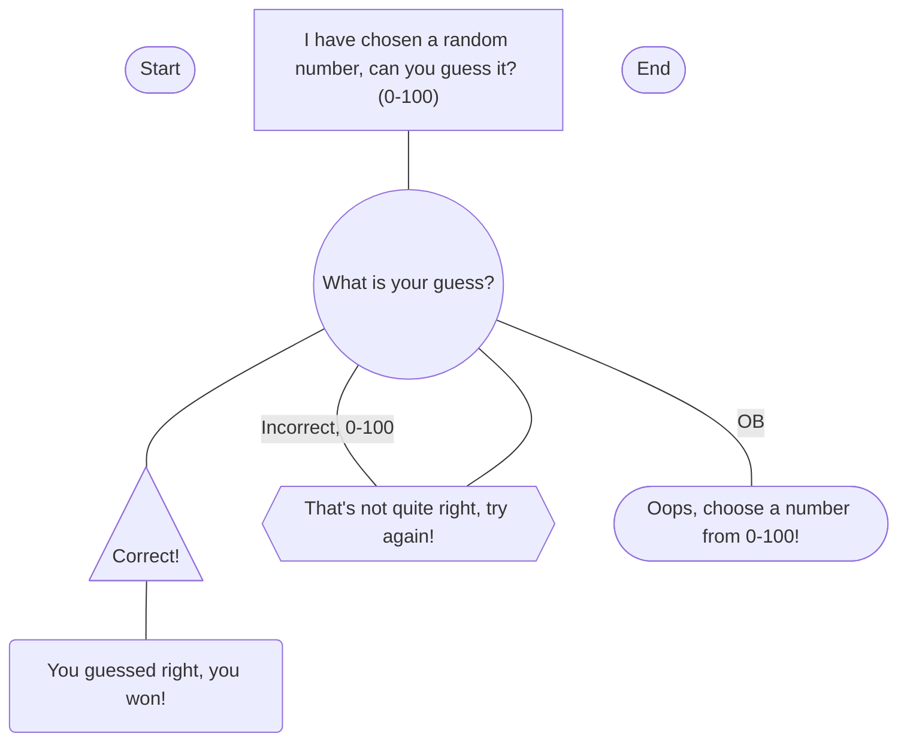

```mermaid
flowchart TD
  Start([Start])
	n2@{ label: "Rectangle" }
	n2["I have chosen a random number, can you guess it? (0-100)"] --- n11
	n11 --- n12@{ shape: "tri", label: "Correct!" }
	n11@{ shape: "circle", label: "What is your guess?" } ---|"Incorrect, 0-100"| n13@{ shape: "diam", label: "That's not quite right, try again!" }
	n1@{ shape: "rounded", label: "You guessed right, you won!" }
	n13
	n13
	n13@{ shape: "hex", label: "That's not quite right, try again!" } --- n11
	n12 --- n1
	n11 ---|"OB"| n3@{ shape: "stadium", label: "Oops, choose a number from 0-100!" }
  End([End])
```
