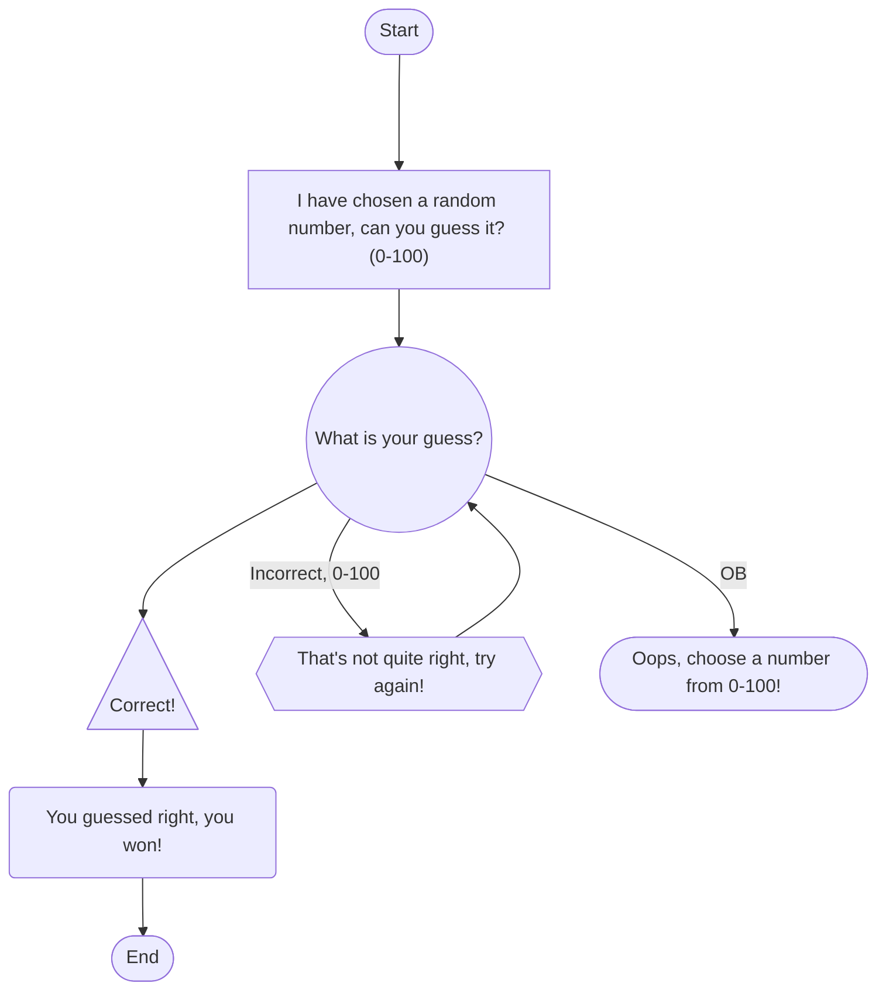

```mermaid
flowchart TD
	Start([Start]) ---> Intro@{ label: "Rectangle" }
	Intro["I have chosen a random number, can you guess it? (0-100)"]
	Intro --> Guess
	Guess --> Correct@{ shape: "tri", label: "Correct!" }
	Guess@{ shape: "circle", label: "What is your guess?" } -->|"Incorrect, 0-100"| Wrong
	Won@{ shape: "rounded", label: "You guessed right, you won!" }
	Wrong@{ shape: "hex", label: "That's not quite right, try again!" }
	Wrong --> Guess
	Correct --> Won
	Guess -->|"OB"| OB@{ shape: "stadium", label: "Oops, choose a number from 0-100!" }
	Won --> End([End])
```
